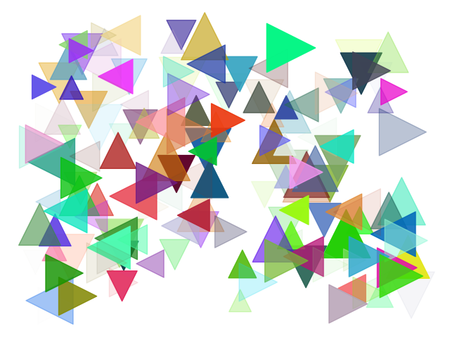
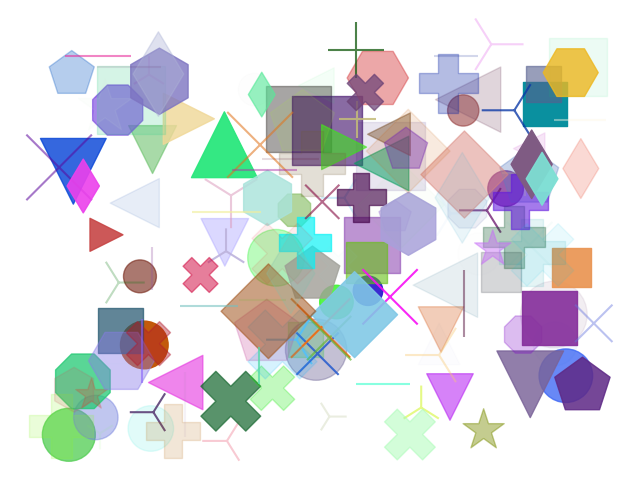

# randomArt.py by Kevin Bolger

The python function defined above can be used to generate a random piece of abstract art, that would undoubtedly be the envy of the greatest artists.

It creates a canvas which is painted with random shapes, each with random sizes, colors and positions.

Truly magnificent.

## Ideas for enhancement

They say you can't improve on perfection. But if you were to try, you might look in to adding a bias towards the symbol types so that symbols that have already been selected have a higher probability of being selected. C'est magnifique.

### Example 1:

### Example 2:

